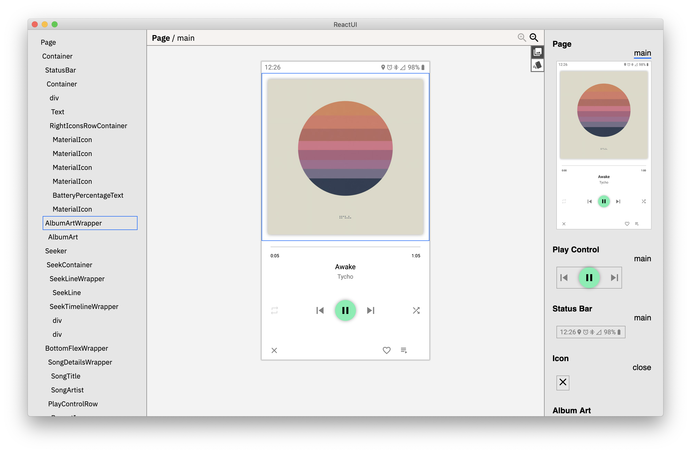
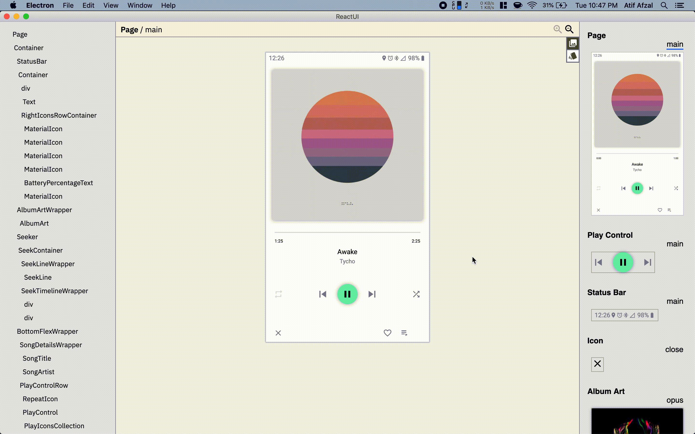

# ReactUI

ReactUI lets you create React components using an intuitive interface. Use drag and drop to compose simple components to create complex components.

## Setup

`yarn`  
`yarn start`

## Keyboard Shortcuts

- Copy: CMD + C
- Paste: CMD + V
- Go to source: CMD + click
- Delete: CMD + Delete
- Save style: CMD + S
- Insert Child Div: CMD + Enter

## Features

### Delete

### Composing Components

### Styling

### Jump directly to code from ui with (CMD + click)

